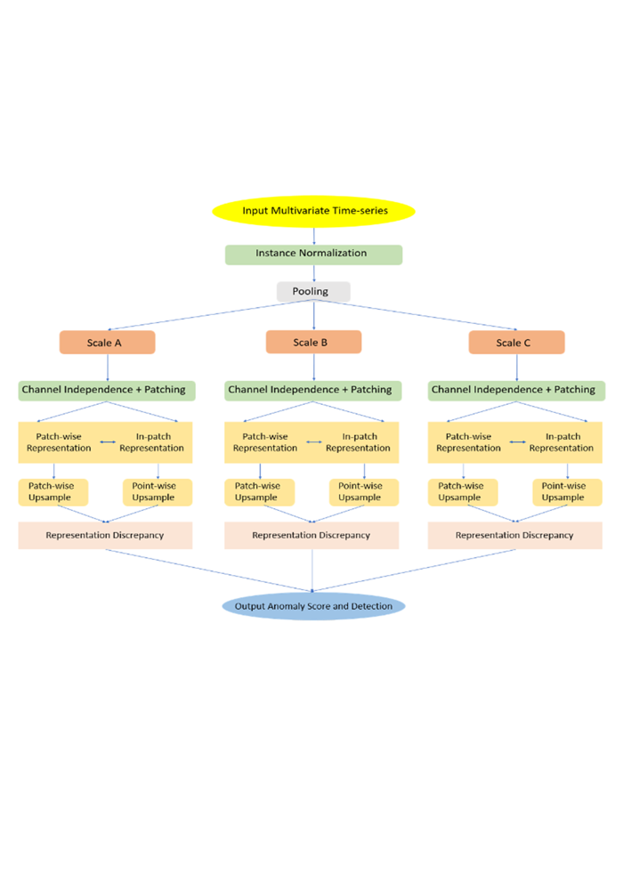
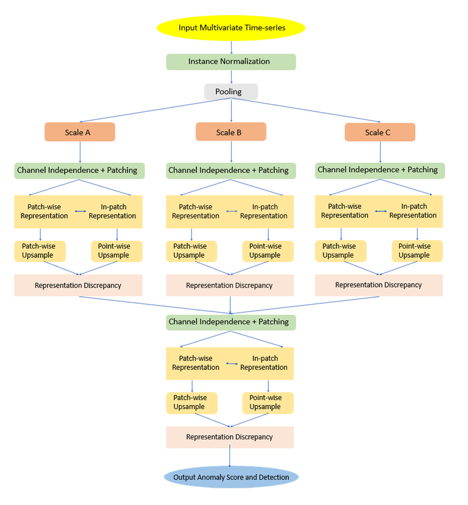
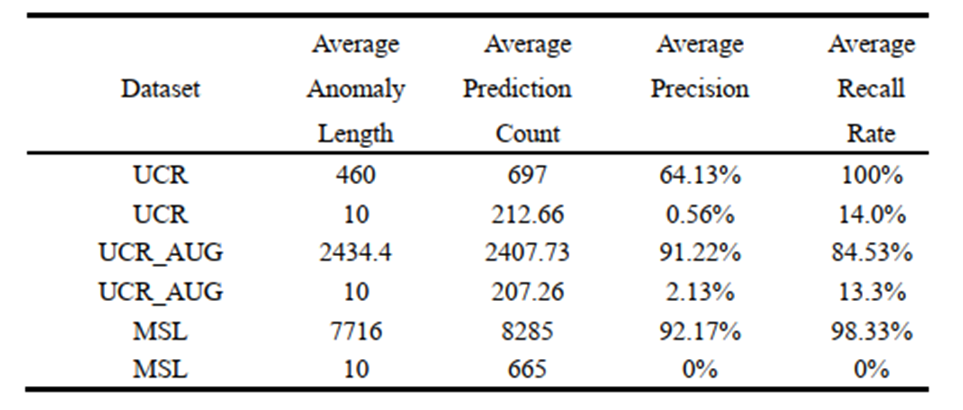
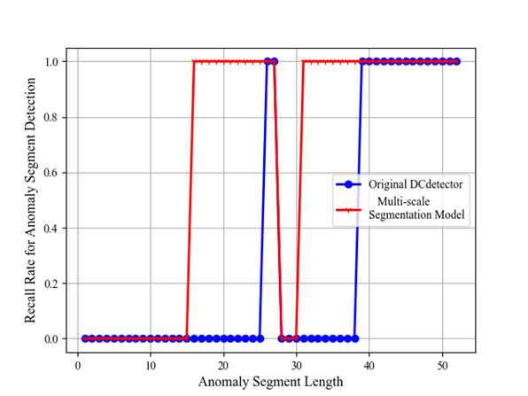
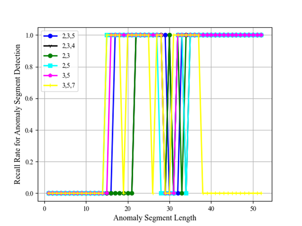
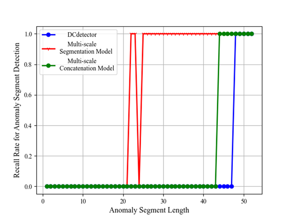
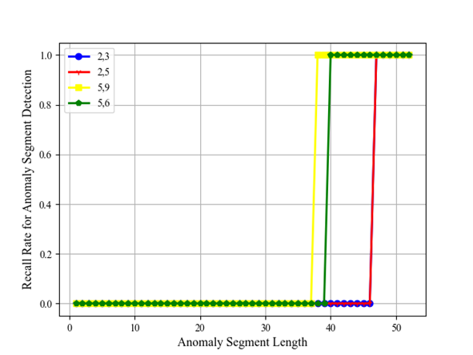

# A Multi-Scale Anomaly Detection Algorithm (AICE 2025)

**Design of a Multi-Scale Flight Parameter Data Anomaly Detection Algorithm**
[[Paper]](paper/paper.pdf)


- The project is based on [DCdetector](https://github.com/DAMO-DI-ML/KDD2023-DCdetector).
- The DCdetector model excels at detecting long-duration anomalies in flight parameter data but performs poorly with short-duration anomalies. To address this limitation, we develop two improved multi-scale variants: a segmentation model that processes different temporal scales separately and a concatenation model that integrates cross-scale features. Experimental results demonstrate that both enhanced models successfully identify short anomalies while maintaining the original model's strong performance on long-duration anomaly detection.

## Architecture

- **Multi-scale segmentation model**: Fig 1 presents the architecture of our multi-scale segmentation model based on DCdetector. The key innovation is a multi-scale feature extraction mechanism where input time-series data undergoes multi-scale downsampling through varying pooling windows, generating subsequences at different temporal resolutions, enabling simultaneous capture of macro trends and micro anomalies.

- **Multi-scale concatenation model**: The enhanced multi-scale concatenation model (Fig. 2) extends the segmentation model by introducing cross-scale feature fusion. After multi-scale decomposition and dual-branch feature extraction, it concatenates all scale features with original representations for joint processing through dual-attention and difference representation modules.

|                     |            
|:----------------------------------------:|:-----------------------------------------:|
| *Fig 1. Multi-scale segmentation model.* | *Fig 2. Multi-scale concatenation model.* |


## Experiments 
- The DCdetector model demonstrates strong performance in detecting long-duration anomalies in flight data but fails to identify short-duration anomalies, as shown across multiple datasets. Table Ⅰ presents the model's detection performance on unmodified UCR, UCR_AUG and MSL datasets, where average precision and recall rates represent means across all test sequences.

|                                            |
|:-------------------------------------------------------------------:| 
| *Table 1. Anomaly Detection Performance Across Original Datasets .* |

- The multi-scale partitioning model greatly improves short anomaly detection. Fig. 3 compares results between the original DCdetector (without multi-scale pooling) and the multi-scale partitioning model on the UCR_1 dataset, and Fig. 4 illustrates the detection results under varying pooling scale combinations.

|                                           |                                                                      
|:------------------------------------------------------------:|:---------------------------------------------------------------------------------------:|
| *Fig 3. Comparison With/Without Multi-scale Pooling Module.* | *Fig 4. Comparative Performance of Multi-scale Segmentation Model at Different Scales.* |


- Comparative experiments (Fig. 5) evaluate the multi-scale concatenation model against the partitioning model and original DCdetector on UCR_1 across varying anomaly lengths. Fig. 6 shows performance varying scale combinations.

|                                           |                                                                      
|:------------------------------------------------------------:|:---------------------------------------------------------------------------------------:|
| *Fig 3. Comparison With/Without Multi-scale Pooling Module.* | *Fig 4. Comparative Performance of Multi-scale Segmentation Model at Different Scales.* |


## Code Description

- dc_detector_ori: The original DCdetector project.
- multi-scale segmentation model: The multi-scale segmentation model project.
- multi-scale concatenation model: The multi-scale concatenation model project.


## Get Start
1. Python >= 3.8, PyTorch >= 1.4.0.
2. Download data from [Google Cloud](https://drive.google.com/drive/folders/1RaIJQ8esoWuhyphhmMaH-VCDh-WIluRR?usp=sharing). 
3. Train and test. Use ```./scripts```. You can reproduce the experiment results as follows:

```bash
bash ./scripts/UCR.sh
```

## Contact
- If you have any question, you're welcomed to contact 20030418lzc@stu.xjtu.edu.cn   

## Citation
- To be determined (Ought to be available in 2026).

## Acknowledgement
- We appreciate the original DCdetector code: https://github.com/DAMO-DI-ML/KDD2023-DCdetector

## Poster
- The poster showed on AICE(2025): [[Poster]](paper/poster.pdf)

